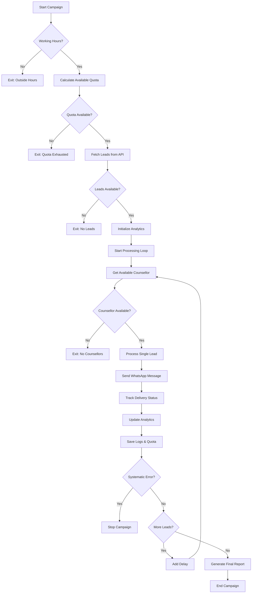

# WATI WhatsApp Lead Automation System - Documentation

## 📋 Table of Contents
- [Overview](#overview)
- [Key Features](#key-features)
- [System Architecture](#system-architecture)
- [Prerequisites & Setup](#prerequisites--setup)
- [Configuration](#configuration)
- [Core Components](#core-components)
- [Workflow & Execution](#workflow--execution)
- [Error Handling](#error-handling)
- [Analytics & Reporting](#analytics--reporting)
- [File Structure](#file-structure)
- [Troubleshooting](#troubleshooting)
- [Best Practices](#best-practices)

---

## 🎯 Overview

The **Enhanced WATI WhatsApp Lead Automation System** is a production-ready Python script designed to automate lead nurturing through WhatsApp messages using the WATI API. This system distributes leads across multiple counsellors, tracks message delivery status, manages daily quotas, and provides comprehensive analytics.

### 🚀 Key Features

- **Advanced Phone Number Validation** - E.164 format compliance
- **Real Delivery Tracking** - Matches WATI dashboard status
- **Smart Error Categorization** - Intelligent retry logic
- **Enhanced Analytics & Reporting** - Comprehensive campaign metrics
- **Professional Logging System** - Multi-level logging with file output
- **Counsellor Distribution** - Automatic load balancing across team members
- **Quota Management** - Daily limits with tracking and persistence
- **Duplicate Prevention** - Prevents sending to same lead multiple times
- **Working Hours Enforcement** - Configurable time restrictions
- **Meta Quality Protection** - Detects and responds to WhatsApp quality restrictions

---

## 🏗️ System Architecture

### Core Classes & Components

```
📦 WATI Lead Automation System
├── 📊 Data Structures
│   ├── MessageStatus (Enum)
│   ├── ErrorCategory (Enum)
│   └── MessageResult (NamedTuple)
├── 📝 Logging System
│   └── OptimizedLogger
├── 🌐 API Integration
│   └── EnhancedWATIClient
├── 🤖 Automation Engine
│   └── EnhancedLeadAutomation
├── 📈 Analytics Engine
│   └── CampaignAnalytics
└── 🎯 Main Execution
    └── Campaign Runner
```

---

## ⚙️ Prerequisites & Setup

### 1. System Requirements
- **Python 3.7+**
- **Internet connection** for API calls
- **WATI Account** with API access
- **Lead API access** (EvolGroups system)

### 2. Required Python Packages
```bash
pip install python-dotenv requests urllib3
```

### 3. Environment Configuration
Create a `config.env` file in the parent directory (`../config.env`) with:

```env
# WATI API Credentials
WATI_API_KEY=your_wati_api_key_here
WATI_BASE_URL=https://live-server-12345.wati.io/api/v1
WATI_INSTANCE_ID=your_instance_id

# Lead API Configuration
LEAD_API_URL=https://evolgroups.com/lead/get-leads-basic-info/
LEAD_API_TOKEN=Token your_api_token_here
LEAD_OWNER_ID=227
WATI_TEMPLATE_NAME=sagarps_leads_work_pr_settle_aus_aug25
WATI_LOG_API_URL=https://evolgroups.com/lead/post-wati-msg-logs/

# Testing Configuration
USE_TEST_NUMBER=false
TEST_MOBILE_NUMBER=+917567905829
```

---

## 🔧 Configuration

### Counsellor Configuration
The system supports 9 counsellors with daily limits (configurable in script):

| Counsellor | Phone Number | Daily Limit |
|------------|--------------|-------------|
| Anandi | +919512270915 | 50 |
| Preeti | +918799334198 | 50 |
| Khushali | +917069629625 | 50 |
| Karan | +919773432629 | 50 |
| Sangita | +918128758628 | 50 |
| Maitri | +918866817620 | 50 |
| Chitra | +918128817870 | 50 |
| Pragatee | +919687046717 | 50 |
| Vaidehi | +917874202685 | 50 |

### Working Hours
- **Default**: 09:00 - 21:00
- **Configurable** via `SCRIPT_START_TIME` and `SCRIPT_END_TIME`

### Template Parameters
Messages are sent with 3 parameters:
1. **Lead Name** - Customer's full name
2. **Counsellor Name** - Assigned counsellor's name  
3. **Counsellor Phone** - Counsellor's contact number

---

## 📦 Core Components

### 1. 📊 Data Structures

#### MessageStatus Enum
```python
SENT = "sent"           # API accepted (HTTP 200)
DELIVERED = "delivered" # Message delivered to WhatsApp
READ = "read"          # Message read by recipient
FAILED = "failed"      # Message failed to send
PENDING = "pending"    # Waiting for delivery confirmation
```

#### ErrorCategory Enum
```python
INVALID_NUMBER = "invalid_number"
NOT_ON_WHATSAPP = "not_on_whatsapp"
OPT_OUT = "opt_out"
TEMPLATE_MISMATCH = "template_mismatch"
QUOTA_EXCEEDED = "quota_exceeded"
NETWORK_ERROR = "network_error"
ACCOUNT_ISSUE = "account_issue"
UNKNOWN_ERROR = "unknown_error"
```

### 2. 📝 OptimizedLogger
- **Dual Output**: Console (INFO+) and File (DEBUG+)
- **Structured Logging**: Campaign start/end, lead processing, results
- **Emoji Indicators**: Visual status representation
- **Encoding Safety**: Handles Unicode issues on Windows

### 3. 🌐 EnhancedWATIClient
- **API Integration**: WATI WhatsApp Business API
- **Retry Logic**: Automatic retry for network failures
- **Phone Validation**: Basic phone number formatting
- **Delivery Tracking**: Polls message status post-send
- **Error Categorization**: Intelligent error classification

#### Key Methods:
- `send_template_message()` - Send WhatsApp template
- `get_delivery_status()` - Check message delivery
- `check_whatsapp_status()` - Verify WhatsApp availability
- `_categorize_wati_error()` - Classify API errors

### 4. 🤖 EnhancedLeadAutomation
Main automation engine that orchestrates the entire process.

#### Key Features:
- **Quota Management**: Tracks daily usage per counsellor
- **Duplicate Prevention**: Maintains sent message history
- **Lead Processing**: Fetches and processes leads sequentially
- **Working Hours**: Enforces time-based restrictions
- **Analytics Integration**: Tracks comprehensive metrics

#### Key Methods:
- `run_campaign()` - Main execution orchestrator
- `process_single_lead()` - Handle individual lead
- `fetch_leads()` - Retrieve leads from API
- `get_available_counsellor()` - Random counsellor selection
- `save_message_log()` - External logging

### 5. 📈 CampaignAnalytics
Comprehensive tracking and reporting system.

#### Tracked Metrics:
- Message counts by status (sent/delivered/read/failed)
- Error categorization statistics
- Counsellor performance breakdown
- Campaign duration and success rates
- Total processed vs successful sends

---

## 🔄 Workflow & Execution

### Campaign Execution Flow



### Detailed Process Steps

1. **🔍 Pre-flight Checks**
   - Verify working hours (09:00-21:00)
   - Calculate available quota across all counsellors
   - Check for remaining capacity

2. **📋 Lead Acquisition**
   - Fetch leads from EvolGroups API
   - Apply filters (owner_id, template_name)
   - Limit to reasonable batch size (500 max)

3. **👥 Counsellor Assignment**
   - Random selection from available counsellors
   - Respect daily limits (50 per counsellor)
   - Update quota tracking in real-time

4. **📤 Message Processing**
   - Check for duplicate sends (today's history)
   - Format template parameters (name, counsellor, phone)
   - Send via WATI API with retry logic
   - Poll for delivery confirmation

5. **📊 Status Tracking**
   - Real-time delivery status checking
   - External API logging for persistence
   - Local file tracking (7-day retention)
   - Analytics aggregation

6. **🔄 Loop Management**
   - Smart delays between sends (1-2 seconds)
   - Systematic error detection
   - Campaign termination on critical failures

7. **📈 Finalization**
   - Generate comprehensive metrics
   - Save persistent data (quotas, sent messages)
   - Display formatted summary report

---

## ⚠️ Error Handling

### Error Categories & Actions

| Category | Description | Action | Continue Campaign? |
|----------|-------------|--------|-------------------|
| **INVALID_NUMBER** | Phone format invalid | Skip lead | ✅ Yes |
| **NOT_ON_WHATSAPP** | User not on WhatsApp | Skip lead | ✅ Yes |
| **OPT_OUT** | User blocked/unsubscribed | Skip lead | ✅ Yes |
| **TEMPLATE_MISMATCH** | Template not approved | Stop campaign | ❌ No |
| **QUOTA_EXCEEDED** | API credits exhausted | Stop campaign | ❌ No |
| **ACCOUNT_ISSUE** | WATI account problems | Stop campaign | ❌ No |
| **NETWORK_ERROR** | Connection issues | Retry/Continue | ✅ Yes |
| **UNKNOWN_ERROR** | Unclassified errors | Continue | ✅ Yes |

### Meta Quality Restrictions
Special handling for WhatsApp Business API quality enforcement:
- **Detection**: Identifies Meta quality restriction messages
- **Response**: Immediate campaign termination
- **Guidance**: Provides 5-step remediation checklist
- **Prevention**: Stops further messaging to prevent account suspension

### Retry Logic
- **HTTP Retries**: 3 attempts for network failures (429, 5xx errors)
- **Backoff Strategy**: Progressive delay between retries
- **Graceful Degradation**: Continue on non-critical failures

---

## 📈 Analytics & Reporting

### Real-Time Metrics
- **Live Progress**: Lead-by-lead processing updates
- **Status Tracking**: Sent/Delivered/Read/Failed counts
- **Performance Monitoring**: Success rates and throughput

### Campaign Summary Report
```
🏁 CAMPAIGN EXECUTION SUMMARY 🏁
✅ STATUS: COMPLETED
📤 Messages Sent: 45
📱 Delivered: 42
👀 Read: 15
❌ Failed: 3
⚡ Success Rate: 95.0%
⏱️ Duration: 0:02:34
```

### Detailed Analytics
- **Counsellor Performance**: Individual send counts and success rates
- **Error Analysis**: Breakdown by error category
- **Time Tracking**: Campaign duration and timing
- **Delivery Analytics**: Real delivery confirmation rates

### Data Persistence
- **Quota Tracking**: `quota_usage.json` (7-day retention)
- **Sent Messages**: `sent_messages.json` (duplicate prevention)
- **Campaign Logs**: `wati_automation.log` (detailed execution log)

---

## 📁 File Structure

### Generated Files
```
📂 Project Directory
├── 📄 lead_automation_wati_optimized.py  # Main script
├── 📄 config.env                         # Configuration (parent dir)
├── 📄 wati_automation.log               # Detailed execution logs
├── 📄 quota_usage.json                  # Daily quota tracking
├── 📄 sent_messages.json               # Duplicate prevention
└── 📄 README.md                        # This documentation
```

### Log File Format
```
09:15:23 | INFO  | 🚀 WATI AUTOMATION CAMPAIGN STARTED
09:15:23 | INFO  | 📊 Available Quota: 450
09:15:23 | INFO  | 📋 Leads to Process: 45
09:15:24 | INFO  | 📞 [001/045] John Doe → Anandi
09:15:26 | INFO  | 📤 SENT: John Doe | ID: msg_abc123
```

---

## 🔧 Troubleshooting

### Common Issues & Solutions

#### 1. **"Missing WATI credentials in config.env"**
- **Cause**: Environment variables not properly loaded
- **Solution**: Verify `config.env` exists in parent directory with all required variables

#### 2. **"No leads available to process"**
- **Cause**: Lead API returning empty results
- **Solution**: Check `LEAD_OWNER_ID`, API endpoint, and authentication token

#### 3. **"All counsellor quotas exhausted for today"**
- **Cause**: Daily limits reached for all counsellors
- **Solution**: Wait for next day or increase daily limits in configuration

#### 4. **"Template not approved" errors**
- **Cause**: WhatsApp template pending approval or rejected
- **Solution**: Check WATI dashboard for template status

#### 5. **High failure rates**
- **Cause**: Phone number format issues or inactive numbers
- **Solution**: Implement better lead qualification and phone validation

#### 6. **Meta Quality Restrictions**
- **Symptoms**: "Meta has restricted" error messages
- **Action Plan**:
  1. Stop all messaging immediately
  2. Review WhatsApp Business Policy compliance
  3. Improve message quality and relevance
  4. Wait 3-7 days before retry
  5. Check WATI/Meta account status

### Debug Mode
Enable detailed debugging by modifying log levels:
```python
# Change in OptimizedLogger setup
console_handler.setLevel(logging.DEBUG)
```

### Performance Optimization
- **Batch Size**: Adjust lead fetch limit (currently 500)
- **Delays**: Modify sleep intervals between sends
- **Timeout Values**: Adjust API timeout settings for network conditions

---

## ✅ Best Practices

### 1. **Operational Guidelines**
- **Regular Monitoring**: Check logs and WATI dashboard frequently
- **Quota Management**: Monitor daily limits to prevent exhaustion
- **Template Compliance**: Ensure messages follow WhatsApp Business Policy
- **Quality Metrics**: Maintain high delivery and engagement rates

### 2. **Security Considerations**
- **Credential Protection**: Never commit `config.env` to version control
- **API Key Rotation**: Regularly rotate WATI API keys
- **Access Control**: Limit script execution to authorized personnel

### 3. **Maintenance Tasks**
- **Log Cleanup**: Archive old log files periodically
- **Data Retention**: Monitor JSON file sizes (auto-cleanup included)
- **Template Updates**: Keep WhatsApp templates current and approved
- **System Updates**: Regularly update Python packages

### 4. **Performance Tips**
- **Off-Peak Execution**: Run during low-traffic hours
- **Network Stability**: Ensure stable internet connection
- **Resource Monitoring**: Monitor system CPU and memory usage

### 5. **Compliance & Ethics**
- **Consent Management**: Only message consented leads
- **Opt-out Handling**: Respect unsubscribe requests immediately
- **Frequency Limits**: Avoid over-messaging customers
- **Content Quality**: Ensure messages provide genuine value

---

## 🚀 Getting Started

### Quick Start Guide

1. **Install Dependencies**
   ```bash
   pip install python-dotenv requests urllib3
   ```

2. **Configure Environment**
   - Create `config.env` with WATI and API credentials
   - Verify all required variables are set

3. **Test Configuration**
   - Set `USE_TEST_NUMBER=true` for initial testing
   - Run script and verify successful test message

4. **Production Deployment**
   - Set `USE_TEST_NUMBER=false`
   - Configure working hours and limits
   - Schedule regular execution

5. **Monitor & Optimize**
   - Check logs regularly
   - Monitor success rates
   - Adjust configuration as needed

### Execution Command
```bash
python lead_automation_wati_optimized.py
```

---

## 📞 Support & Maintenance

For technical support or feature requests, refer to:
- **Log Files**: Check `wati_automation.log` for detailed execution history
- **WATI Dashboard**: Monitor message delivery and account status
- **System Administrator**: For API access and configuration issues

---

*This documentation covers version 2.0 (Enhanced) of the WATI WhatsApp Lead Automation System. Last updated: 2024*
